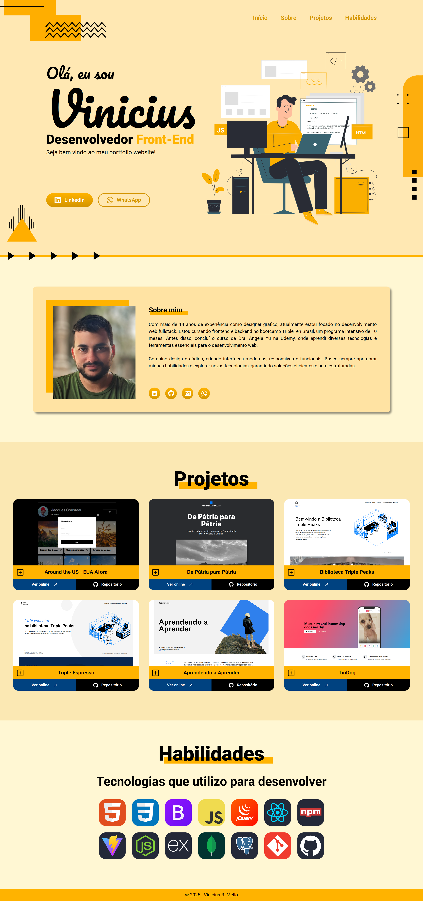
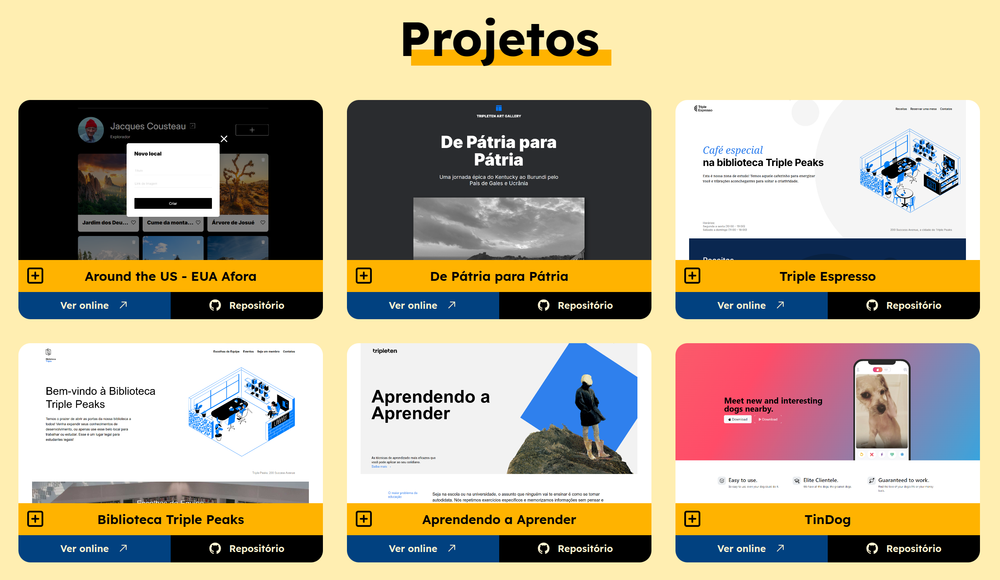
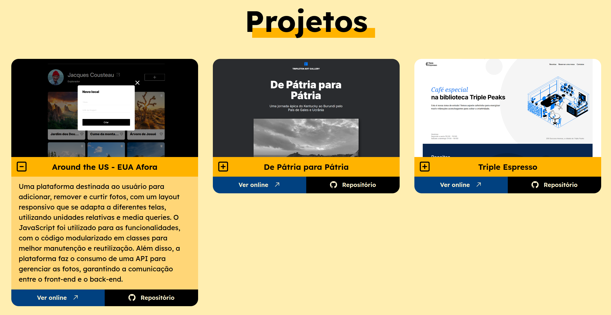
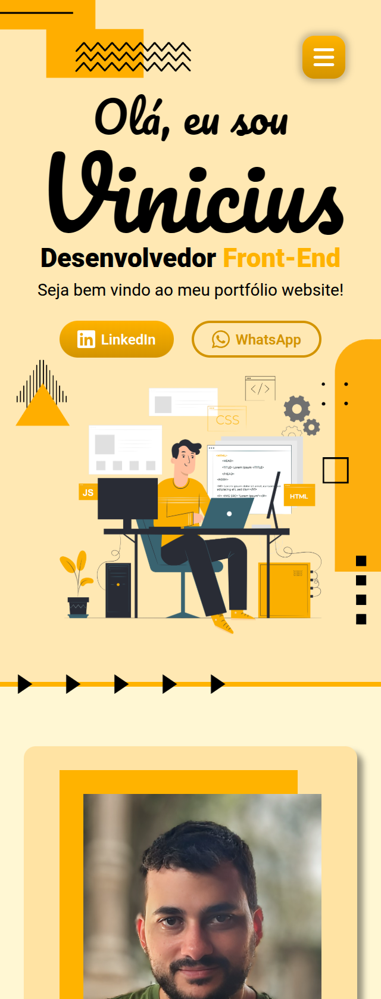

# Portfólio

Este projeto é o meu portfólio pessoal, desenvolvido para compartilhar informações sobre mim e os projetos que criei. Utilizando `HTML`, `CSS` e `JavaScript`, o site é dividido em várias seções: no header há uma introdução, no main uma seção de perfil, uma seção com os projetos desenvolvidos e uma seção destacando as habilidades.

 

**Veja o projeto em execução clicando [aqui](https://vinimello90.github.io/portfolio/).**

## Tecnologias e Métodos

- HTML5 semântico
- Metodologia BEM
- Flexbox
- Grid
- Hover
- Pseudo-classes
- Unidades de medida relativas
- Media queries
- JavaScript

## Descrição das Tecnologias e Técnicas

### HTML Semântico

O `HTML semântico` foi utilizado para tornar o código mais legível e fácil de entender, facilitando a manutenção e a acessibilidade do projeto.

### Metodologia BEM

A `metodologia BEM` (Bloco, Elemento, Modificador) foi adotada para melhorar a organização e clareza no nomeamento das classes CSS, tornando o código mais escalável e fácil de manter.

### Flexbox

Utilizei o `Flexbox` em conjunto com `unidades de medida relativas` para otimizar o layout e garantir a responsividade da página, especialmente em diferentes tamanhos de tela.

### Grid

O `CSS Grid` foi empregado na seção de projetos, permitindo uma organização eficiente dos elementos como fotos, nomes, descrições e links para o repositório no GitHub e a página online. A combinação com as `unidades de medida relativas` garante uma excelente experiência em dispositivos de diferentes tamanhos.

- Seção de Projetos

  

### Hover e Box-shadow

Adicionei a pseudo-classe `:hover` nos elementos interativos, permitindo mudanças de estilo quando o usuário passa o cursor sobre eles. O `box-shadow` foi utilizado para adicionar profundidade aos elementos, criando um efeito visual de sombra.

### Media Queries

As `media queries` foram implementadas para adaptar o layout a diferentes tamanhos de tela, garantindo uma experiência responsiva. Foram configurados pontos de interrupção específicos, levando em consideração três intervalos de resolução.

### JavaScript

No `JavaScript`, utilizei `classes` para adicionar o mockup dos cards na seção "Projetos" e para gerenciar a interação com o usuário. Um `eventListener` foi adicionado ao botão ao lado do título do card, permitindo expandir o card e exibir a descrição do projeto com uma animação suave, utilizando a propriedade `transition`.

- Expansão do Card

  

 

Além disso, em telas menores, o menu de navegação foi ocultado e substituído por um botão. Através de `eventListeners`, o menu vertical pode ser aberto ao pressionar o botão e fechado ao clicar fora do menu, nos links ou no botão de fechar.

     
    

## Planos de Melhoria

- Melhorar o design e layout da página.
- Integrar novas tecnologias, como `React` e frameworks modernos.
- Destacar projetos futuros de maior relevância.
