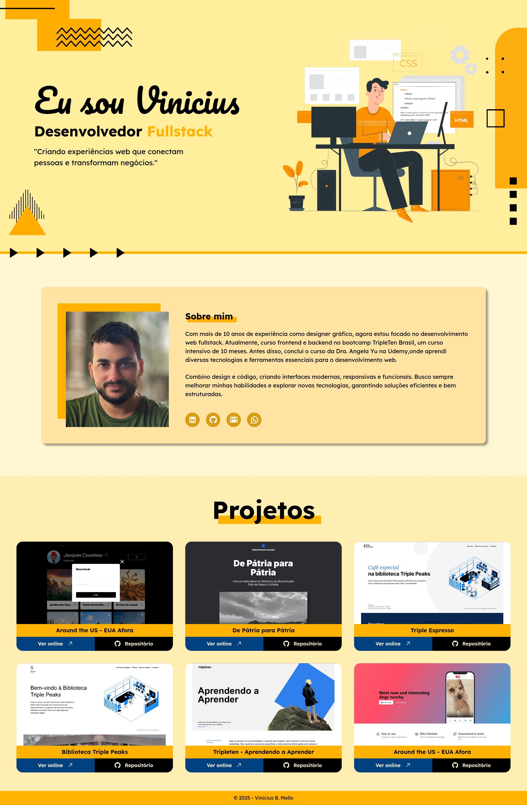

# Portfólio

Este projeto é o meu portfólio, destinado a compartilhar informações sobre mim e os projetos que foram desenvolvidos. Foi desenvolvido utilizando `HTML`, `CSS` e `JavaScript`. O site é dividido em seções: no header, há uma seção de introdução, uma seção de perfil falando sobre mim e uma seção com os projetos que foram desenvolvidos.
 

**Para ver o projeto em execução clique <a href="https://vinimello90.github.io/portfolio/">aqui</a>.**

## Tecnologias

- HTML5 semântico
- Metodologia BEM
- Flexbox
- Grid
- Text-overflow
- Hover
- Pseudo-classe
- Unidades de medida relativas
- Media queries
- React JS
- API

## Descrição das Tecnologias e Técnicas Utilizadas

### HTML semântico

O `HTML semântico` foi aplicado para tornar o código mais compreensível, enquanto a `metodologia BEM` facilita a manutenção e a compreensão do código.

### Metodologia BEM

A `metodologia BEM` facilita a manutenção e a compreensão do código.

### Flexbox

O `Flexbox` foi usado juntamente com `unidades de medidas relativas` para organizar e otimizar a responsividade do layout.

### Grid

O `Grid` foi usado na seção dos projetos, com foto, nome do projeto, descrição e links para a página online e para o repositório no `GitHub`, a fim de criar um layout mais organizado e bem distribuído para o conteúdo das seções. Juntamente com as `unidades de medida relativas`, isso otimiza a responsividade do layout.

- Seção dos Projetos

### Hover e Box-shadow

Foi aplicado a pseudo-classe `:hover` na parte interativa para mudar o estilo quando o usuário passar o cursor sobre o elemento e o `box-shadow` foi usado para adicionar profundidade a alguns elementos aplicando um efeito de sombra.

### Media Queries

As `media queries` foram implementadas para ajustar o layout de acordo com os pontos de interrupção e garantir a responsividade em várias resoluções de tela. Foram adicionados dois pontos de interrupção para assegurar a responsividade, foram definidos com base em três intervalos.

### JavaScript

No `JavaScript`, foram utilizadas `classes` para adicionar o mockup do card ao `grid` na seção "projects" e adicionar o `eventListener` para manipular e renderizar os mockups dos cards através dos métodos da classe. Isso permite expandir e fechar a área de descrição, além de facilitar a adição e alteração dos cards na lista de projetos. Além disso, foi aplicada a propriedade `transition` para criar uma animação suave ao expandir.

## Planos de melhoria do projeto

- Melhorar o design e layout da página.
- Aplicar novas técnologias como `React` e `frameworks`.
- Colocar futuros projetos relevantes em destaque.
